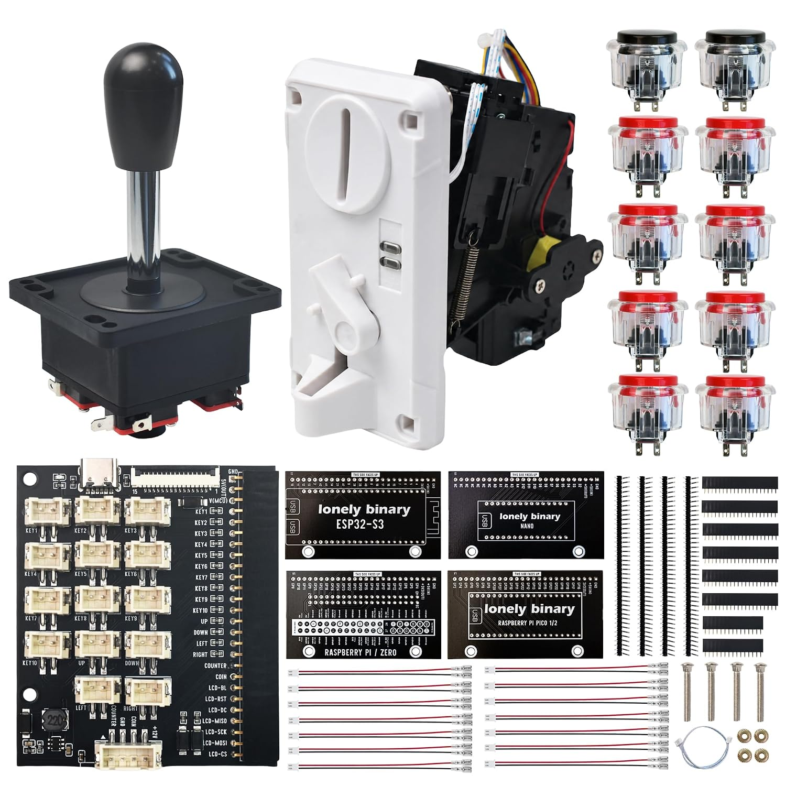

# HotSwap Arcade Kit

Ten buttons, a joystick and a coin acceptor on one mainboard, and four adapters
that plug it into an ESP32-S3, a classic Arduino Nano, a Raspberry Pi Pico or
Pico 2, or a Raspberry Pi Zero 2 W. This repository holds the example code.

**The handbook is at [learn.lonelybinary.com/p/arcade](https://learn.lonelybinary.com/p/arcade)**: pin
tables for every adapter, power, coins, the screen, a coin-operated game, and
the mainboard in 3D.



## Quick start

1. Seat your development board on its adapter, and the adapter on the
   mainboard's 26-pin socket, with every cable unplugged.
2. Plug one button into **KEY1** and your board's own USB into your computer.
   The mainboard's USB-C is power only; it has no data lines.
3. Run the input monitor for your board and press KEY1:

| Board | Adapter | Run | Language |
| --- | --- | --- | --- |
| ESP32-S3 (DevKitC-1 layout) | ESP32-S3 | [`arduino/InputMonitor`](examples/arduino/InputMonitor/InputMonitor.ino) | Arduino C++ |
| Classic Arduino Nano | NANO | [`arduino/InputMonitor`](examples/arduino/InputMonitor/InputMonitor.ino) | Arduino C++ |
| Raspberry Pi Pico or Pico 2 | PICO 1/2 | [`pico/arcade.py`](examples/pico/arcade.py) + [`pico/input_monitor.py`](examples/pico/input_monitor.py) | MicroPython |
| Raspberry Pi Zero 2 W | ZERO | [`zero2w/input_monitor.py`](examples/zero2w/input_monitor.py) | Python |

```text
KEY1 pressed
KEY1 released
```

Each Arduino sketch names its board settings in its first lines. For coins,
also plug the mainboard's USB-C into a 5 V, 2 A supply: the acceptor runs on
12 V made on the mainboard, and nothing else powers it.

## Examples

| Example | What it does | Handbook |
| --- | --- | --- |
| [Input monitor](examples/README.md) | Prints every button and joystick direction | [Press a button](https://learn.lonelybinary.com/manuals/arcade/press-a-button) |
| [Coin probe](examples/README.md) | Counts the pulses one coin sends | [Count the pulses](https://learn.lonelybinary.com/manuals/arcade/count-the-pulses) |
| [Credit game](examples/pico/credit_game.py) | A coin buys a ten-second round (Pico) | [A coin-operated game](https://learn.lonelybinary.com/manuals/arcade/a-coin-operated-game) |
| [Display test](examples/README.md) | Colour bars on an ILI9488 screen | [Add a screen](https://learn.lonelybinary.com/manuals/arcade/add-a-screen) |

The handbook quotes these files at a release tag, so what it explains is
exactly what is here. See [examples/README.md](examples/README.md) for which
files to copy to each board.

## Hardware

Pin tables for all four adapters are in the
[quick reference PDF](https://learn.lonelybinary.com/downloads/arcade-quick-reference.pdf) and on
[the handbook's reference page](https://learn.lonelybinary.com/manuals/arcade). Schematics and net lists
are in [hardware/](hardware/README.md). STEP, GLB and mechanical drawings are
published in [Lonely-Binary/cad](https://github.com/Lonely-Binary/cad/releases?q=arcade).

## Questions and bugs

- **A bug in the code:** open an issue here with the adapter, the development
  board, the example and its exact output.
- **A question about using the kit:** ask in the discussion at the foot of
  any page of [the handbook](https://learn.lonelybinary.com/p/arcade).
