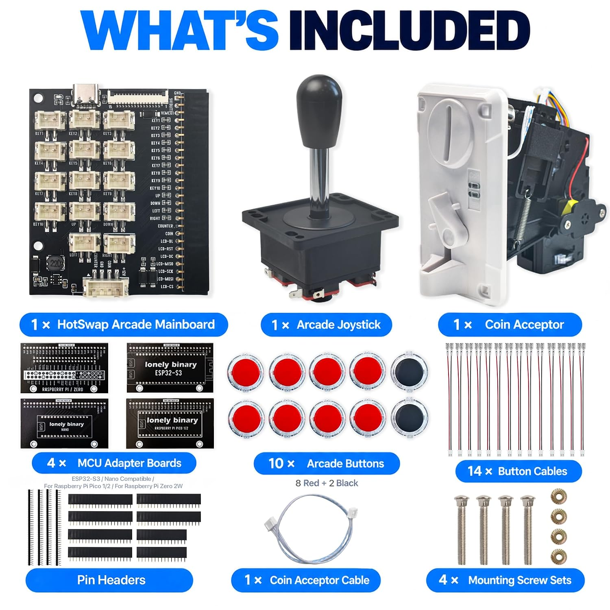
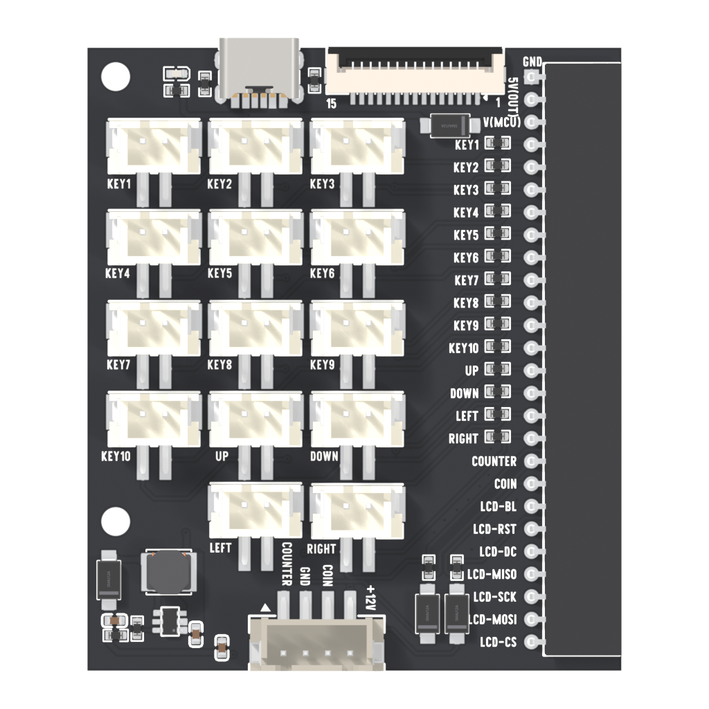
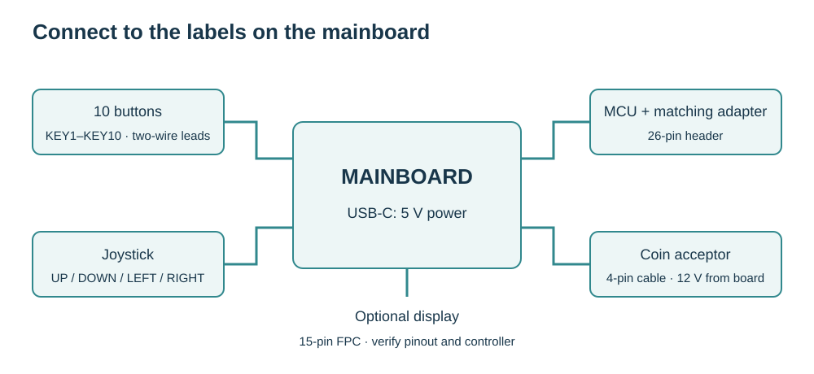
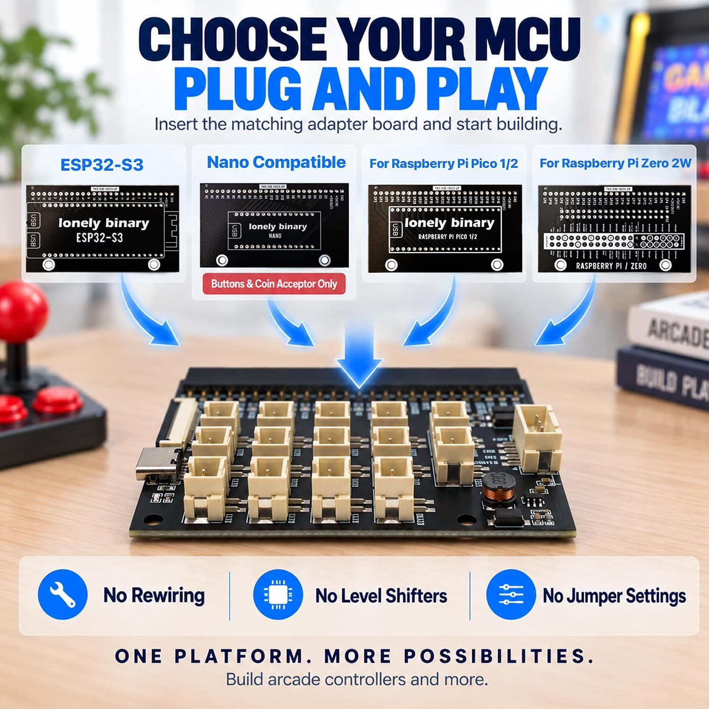
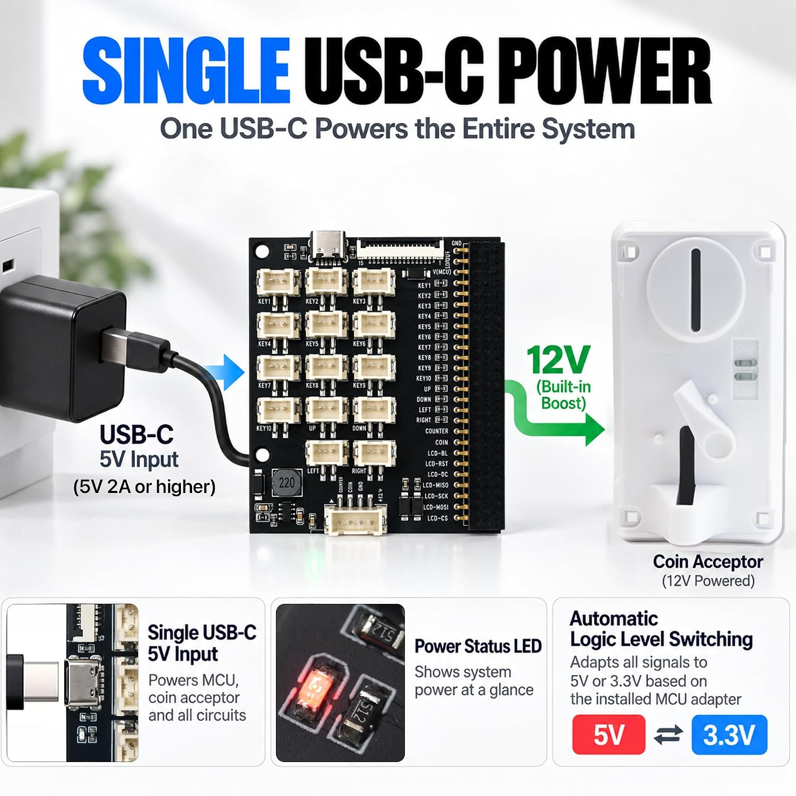

# 1. Meet the kit

[Home](../../README.md) · Next: [Set up your board](02-boards.md)

Your first goal is simple: **press one button and see its name on your computer.** Add the joystick, coin acceptor and screen after that works.

## Lay out the parts

The pictured bundle contains a mainboard, four MCU adapters, one joystick, ten buttons, fourteen button leads, a coin acceptor and its cable, pin headers and mounting hardware. Your order's contents take precedence over this picture.

You also need a matching development board, a USB data cable and a regulated **5 V USB supply**. The product image specifies **2 A or higher**; actual requirements depend on the board, display and coin acceptor. Zero 2 W also needs a microSD card. The screen is optional.

## Find the connectors

| Label / connector | Connects to |
| --- | --- |
| USB-C | 5 V power input; this is not the programming port |
| 26-pin side header | Matching MCU adapter |
| KEY1–KEY10 | Ten push buttons |
| UP / DOWN / LEFT / RIGHT | Four joystick microswitches |
| 4-pin coin connector | Supplied coin-acceptor cable |
| 15-pin, 1.0 mm FPC | Compatible display assembly |

## Assemble with power disconnected

1. Choose the adapter matching your development board. If its headers are loose, solder them straight before use; simply resting a board on loose pins is unreliable.
2. Match the development board's pin labels to the adapter. Check **GND and 5 V/3V3 at both ends** before seating it. Different ESP32 boards can have different layouts.
3. Seat the adapter on the mainboard's 26-pin connector. Check every pin is aligned; do not offset it by one position.
4. Connect one button to **KEY1** using a two-wire lead. Leave the coin acceptor and display disconnected for now.
5. Follow the [board setup](02-boards.md), then run the [input test](03-inputs.md).

## Power and programming

The mainboard takes 5 V and generates the coin acceptor's 12 V supply. The adapter establishes the input logic rail: 5 V for the classic Nano, 3.3 V for the other adapters. The mainboard already has pull-down resistors for its button inputs.

- Upload firmware through the **development board's USB port**.
- For standalone operation, power the assembled kit through **mainboard USB-C**.
- For initial flashing, remove the development board from the unpowered kit and use its USB connection alone. Disconnect USB before reinstalling it.
- For a live serial test, use one powered USB source. If powering the kit from mainboard USB-C while using the development board's USB data connection, use an appropriate **VBUS-blocking data adapter** on the development-board connection. An ordinary USB cable supplies power too; adapter-board power paths differ.
- Turn everything off before moving connectors. “HotSwap” describes interchangeable adapters here; do not change them under power.

**Pass:** the power LED lights and pressing KEY1 produces a message in the input test. An illuminated power LED alone does not confirm that firmware is running.
