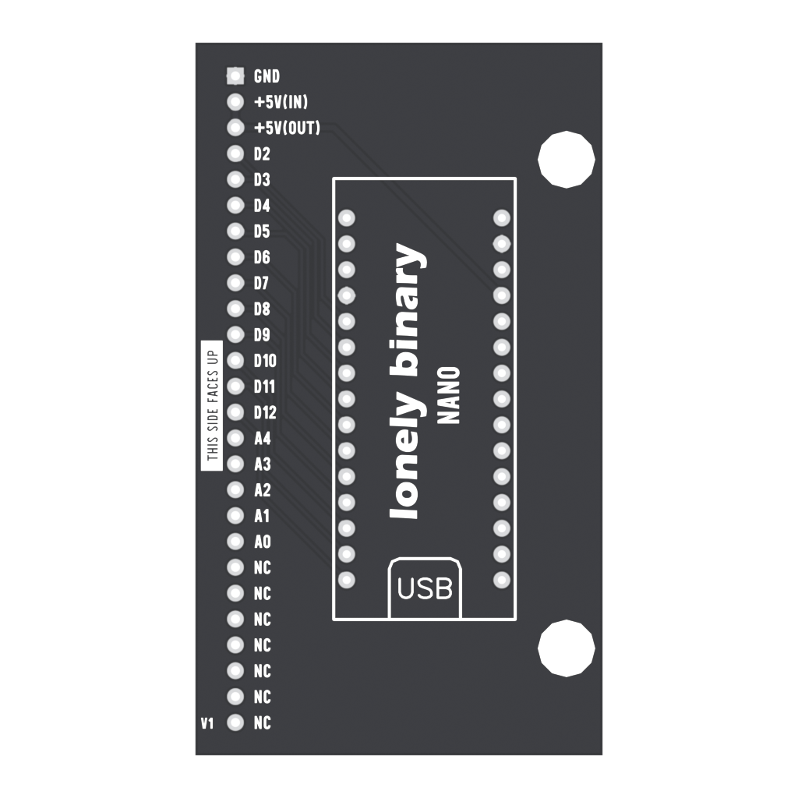
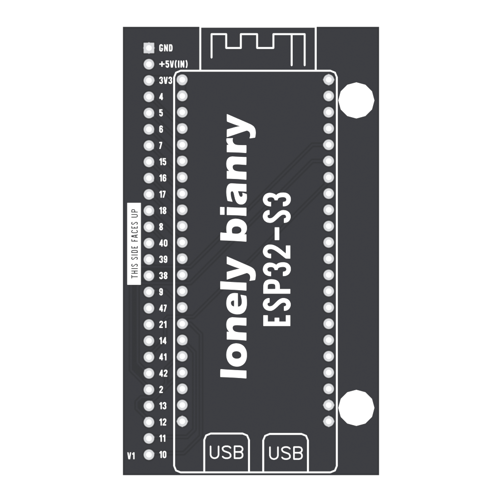
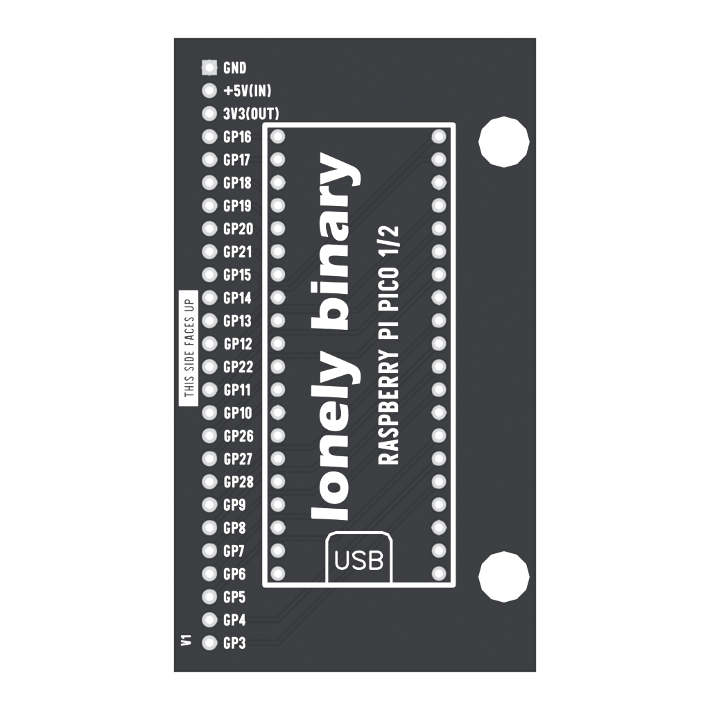
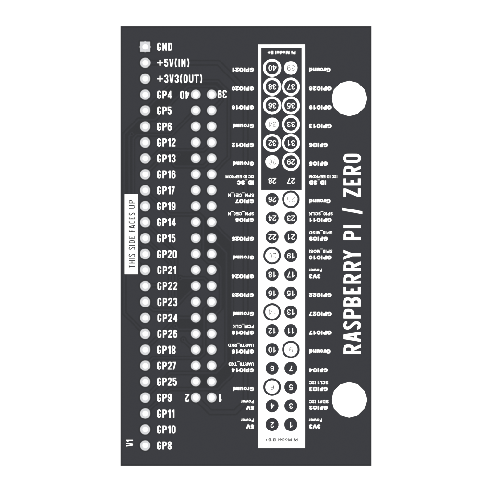

# 2. Set up your board

[Previous](01-start.md) · [Home](../../README.md) · [Next: Inputs](03-inputs.md)

Download this repository with **Code → Download ZIP**, then extract it. Keep the example folders together. Follow only the section for your board.

## Arduino Nano



This route is for the **classic 5 V ATmega328P Nano**, not Nano ESP32, Nano Every or Nano 33.

1. Install [Arduino IDE](https://www.arduino.cc/en/software).
2. In Boards Manager, install **Arduino AVR Boards**.
3. Open `examples/arduino/InputMonitor/InputMonitor.ino`.
4. Connect the Nano with a USB data cable. Select **Arduino Nano**, **ATmega328P** and its port under Tools.
5. Click Upload. If your compatible board uses the older bootloader, select **ATmega328P (Old Bootloader)** and retry.
6. Assemble the unpowered kit, arrange [power and USB data](01-start.md#power-and-programming), then open Serial Monitor at **115200**. Press KEY1.

These starter sketches need no extra libraries. The mainboard provides the external pull-down resistors the Nano needs.

## ESP32-S3



1. Install Arduino IDE. In Preferences, add this to **Additional Boards Manager URLs**:

   ```text
   https://espressif.github.io/arduino-esp32/package_esp32_index.json
   ```

2. In Boards Manager, install **esp32 by Espressif Systems**.
3. Open `examples/arduino/InputMonitor/InputMonitor.ino`.
4. Select **ESP32S3 Dev Module** and the board's port. Check flash size and USB settings against your exact development board.
5. Upload, then open Serial Monitor at **115200**. If using native USB, enable **USB CDC On Boot** where required by the board. If using a USB-to-serial port, use that port's settings.
6. Follow the power arrangement in Step 1 and press KEY1.

Match the physical header layout before installing an ESP32-S3 board. “ESP32-S3” identifies the chip family, not a universal connector layout. [Espressif installation guide](https://docs.espressif.com/projects/arduino-esp32/en/latest/installing.html).

## Raspberry Pi Pico / Pico 2



1. Download MicroPython for your exact board: [Pico](https://micropython.org/download/RPI_PICO/) or [Pico 2](https://micropython.org/download/RPI_PICO2/). W models need their own matching firmware.
2. With the board removed from the unpowered kit, hold **BOOTSEL** while connecting USB. Copy the downloaded `.uf2` to the USB drive that appears. The board restarts automatically.
3. Install [Thonny](https://thonny.org). Select **MicroPython (Raspberry Pi Pico)** and the board's port in the interpreter settings.
4. Open `examples/pico/arcade.py` and save it to the **Raspberry Pi Pico** as `arcade.py`.
5. Do the same for `input_monitor.py`. Open that file on the Pico and click Run. Use the [power/data arrangement](01-start.md#power-and-programming) when the board is in the kit.
6. Press KEY1 and watch the Shell. Ctrl+C stops the program.

Saving a file on your computer does not copy it to the Pico. Both files must be on the board. Later, save the desired entry program as `main.py` to run it automatically at startup.

## Raspberry Pi Zero 2 W



This is a Linux computer. It runs Raspberry Pi OS and normal Python, not Pico MicroPython.

1. Use [Raspberry Pi Imager](https://www.raspberrypi.com/software/) to write Raspberry Pi OS to a microSD card. Set a username, password, Wi-Fi and SSH if you want remote access. Follow the [official setup guide](https://www.raspberrypi.com/documentation/computers/getting-started.html).
2. Boot the Pi. Open a terminal locally or connect with `ssh YOUR_USER@YOUR_HOSTNAME.local` using the values you chose in Imager.
3. Run `sudo raspi-config`. Under **Interface Options → Serial Port**, disable both the serial login shell and serial hardware. This releases **BCM14/15**, used by KEY9/KEY10. Reboot.
4. Install the dependencies and download the examples:

   ```bash
   sudo apt update
   sudo apt install -y git python3-gpiozero python3-lgpio python3-spidev
   git clone https://github.com/Lonely-Binary/Arcade-HotSwap-Kit.git
   cd Arcade-HotSwap-Kit/examples/zero2w
   python3 input_monitor.py
   ```

5. Press KEY1. Stop with Ctrl+C. If permissions fail, run `sudo usermod -aG gpio,spi "$USER"`, then log out and back in.

Enable SPI in `raspi-config` only when you reach the display lesson. If you downloaded a ZIP instead, copy the extracted repository to the Pi and enter its `examples/zero2w` directory. Never run the GPIO examples on your Mac or Windows computer.

Before disconnecting Pi power, run `sudo shutdown -h now` and wait for shutdown. [Raspberry Pi configuration reference](https://www.raspberrypi.com/documentation/computers/configuration.html).
