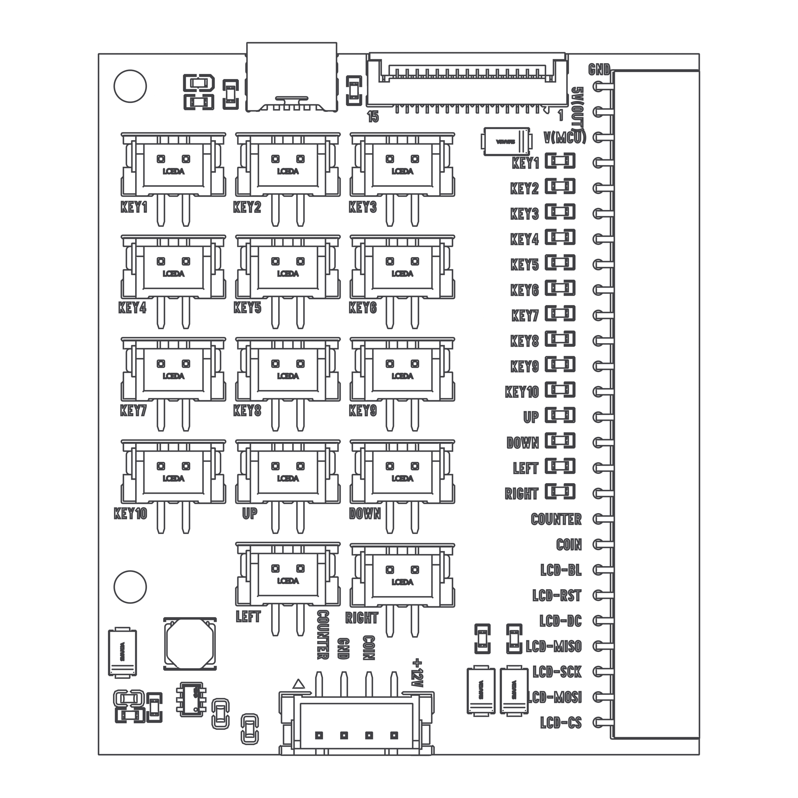

# 3. Buttons and joystick

[Previous](02-boards.md) · [Home](../../README.md) · [Next: Coins](04-coins.md)

## Run the input monitor

| Board | File |
| --- | --- |
| Nano or ESP32-S3 | [InputMonitor.ino](../../examples/arduino/InputMonitor/InputMonitor.ino) |
| Pico / Pico 2 | [input_monitor.py](../../examples/pico/input_monitor.py) |
| Zero 2 W | [input_monitor.py](../../examples/zero2w/input_monitor.py) |

Use the upload/run steps in [Board setup](02-boards.md). For Arduino, open Serial Monitor at **115200 baud**. For Pico, watch the Thonny Shell. For Zero 2 W, watch the terminal.

Press and release KEY1. Expected output:

```text
KEY1 pressed
KEY1 released
```

The button connects the input to the board's logic rail when pressed: **pressed = HIGH**. The examples wait for a stable state for 30 ms so one physical press does not create several events.

## Add the other buttons

Disconnect power. Connect the remaining buttons to KEY2–KEY10, then run the same test. Confirm each label before mounting the buttons in a panel.

Button lighting, if present, may use separate terminals. Connect the **switch contacts** for this lesson; do not connect LED terminals to an input as though they were a switch.

## Add the joystick

Connect each of the four microswitches to the matching direction input. For a switch with three terminals, use **COM and NO** (normally open), leaving NC unused. These two-wire inputs connect a switch between the signal and V(MCU); do not substitute a shared ground harness.



Move the stick and check the reported direction. The mechanical switch location can be opposite the direction you move the handle. Use the output to identify it; swap the appropriate leads with power off if needed.

```text
UP pressed
UP released
LEFT pressed
LEFT released
```

**Pass:** all ten buttons and four directions report correctly. A diagonal may activate two directions together.

The older test programs call the directions “buttons 11–14”: **11 = UP, 12 = DOWN, 13 = LEFT, 14 = RIGHT**. See the [pin table](pin-reference.md) when modifying a program.
