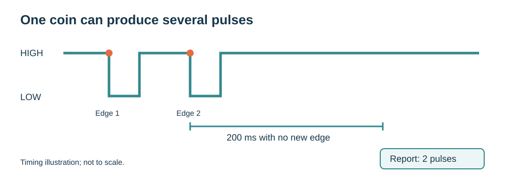

# 4. Your first coin

[Previous](03-inputs.md) · [Home](../../README.md) · [Next: Make a game](05-game.md)

## Connect the acceptor

1. Disconnect power.
2. Connect the supplied four-wire cable to the mainboard's coin connector and the matching acceptor connector.
3. Check the markings: **COUNTER, GND, COIN, +12V**. Do not infer the pinout from wire colors on replacement cables.
4. Power the mainboard from its 5 V USB-C input. The mainboard supplies 12 V to the acceptor; do not feed 12 V into USB-C or a GPIO.

The reference tests use a **JY109** acceptor. Use the instructions for your exact acceptor to learn a coin and select its pulse count and output mode; programming button sequences can vary between models. Do not assume it recognizes a currency out of the box.

## Find the input before assigning a value

Run the matching coin probe:

| Board | Example | Inputs observed |
| --- | --- | --- |
| Nano | [CoinProbe.ino](../../examples/arduino/CoinProbe/CoinProbe.ino) | A0 |
| ESP32-S3 | [CoinProbe.ino](../../examples/arduino/CoinProbe/CoinProbe.ino) | GPIO14 and GPIO21 |
| Pico / Pico 2 | [coin_probe.py](../../examples/pico/coin_probe.py) | GP28 |
| Zero 2 W | [coin_probe.py](../../examples/zero2w/coin_probe.py) | BCM26 and BCM24 |

Insert one learned coin, wait a second and read the result:

```text
GP28: 1 pulse(s)
```

The ESP32-S3 and Zero 2 W probes observe two inputs because the PCB exports and original test programs use different coin pins. Repeat with five coins. Record which channel responds consistently. If both respond, check the connector continuity and output behavior before choosing one; **do not add both counts together**. Details: [Compatibility](compatibility.md).

## Understand pulses



One coin can produce several low pulses. The examples use a 60 ms edge lockout and treat 200 ms without another accepted edge as the end of a group. These starting values came from the supplied tests; they must match your acceptor's settings.

| Observed result | Meaning |
| --- | --- |
| One group, one pulse | One accepted coin configured for one pulse |
| One group, three pulses | One accepted coin configured for three pulses |
| No group | Coin rejected, wrong input, output mode or power issue |
| One coin creates several groups | Group timeout may be shorter than the pulse spacing |
| Fewer pulses than configured | Lockout may be too long for the chosen pulse rate |

**Pulse counts do not identify a currency by themselves.** The old labels “USD”, “CNY” and “Game” were test settings. Define your own mapping after learning the coins.

**Pass:** five identical coins each produce one group with the same pulse count. Then try an unlearned coin and confirm it does not create credit.
