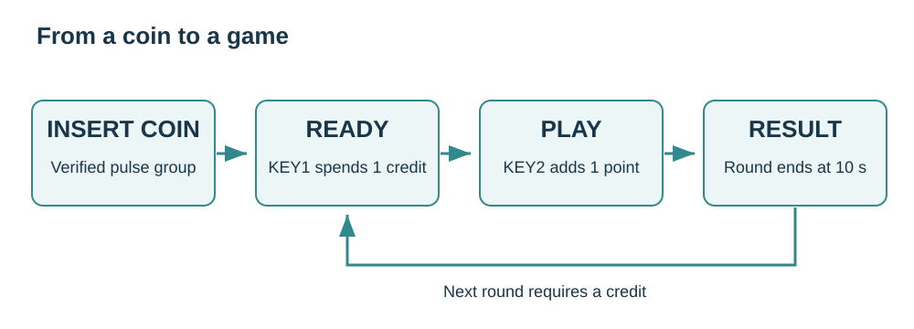

# 5. Build a coin-operated game

[Previous](04-coins.md) · [Home](../../README.md) · [Next: Display](06-display.md)

**Project: ten-second button challenge.** Insert a coin, press Start, then hit the score button as often as you can. No display is needed; the Thonny Shell shows credits, score and the result.

## Connect

Use a Pico or Pico 2 with its adapter, the coin acceptor and two buttons:

| Connection | Role |
| --- | --- |
| KEY1 / GP16 | Start |
| KEY2 / GP17 | Score |
| COIN / GP28 | Add credit |

First pass the [input](03-inputs.md) and [coin](04-coins.md) tests. Copy [arcade.py](../../examples/pico/arcade.py) and [credit_game.py](../../examples/pico/credit_game.py) onto the Pico using Thonny. Open `credit_game.py` and run it.

## Play

1. Press Start without inserting a coin: the program says `Insert a coin`.
2. Insert your learned coin: `Credits: 1`.
3. Press Start: one credit is spent and the round begins.
4. Press and release KEY2 repeatedly for ten seconds.
5. Read your final score. Another round needs another credit.

```text
Credits: 1
GO! Press KEY2 for 10 seconds
Score: 1
Score: 2
Time up! Score: 2
```



## Make it yours

Change the constants at the top of `credit_game.py`:

```python
CREDITS_BY_PULSES = {1: 1}  # Only accept a verified pulse group.
ROUND_MS = 10_000
```

For a coin trained to send three pulses, use `{3: 1}`. This gives **one credit per three-pulse group**, not three credits. Unknown groups are ignored. A held score button counts once; release it before pressing again.

The game uses three ideas: a pulse group creates credit, Start spends credit, and a timer ends the round. It keeps polling while the game runs. Avoid long `sleep()` calls in that loop: they can hide button transitions and coin pulses.

To start automatically after power-up, save `credit_game.py` on the Pico as **`main.py`**, alongside `arcade.py`. Reset the board. Stop it from Thonny with Ctrl+C when editing.

Credits and scores are stored in RAM and reset on power loss. This is a learning game, not a payment or accounting system.
