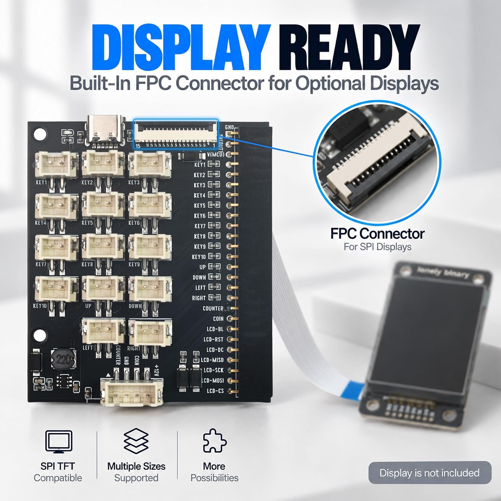

# 6. Add a display

[Previous](05-game.md) · [Home](../../README.md) · [Next: Enclosure](07-build.md)

## Identify the screen

The display is optional. These examples target the **3.5-inch ILI9488, 480 × 320 SPI screen** used by the supplied test programs. Check the controller printed on the module or its documentation first.

The [six-screen display kit](https://www.amazon.com/dp/B0GR4HRVV2) lists ST7735S, ST7789 and ST7796 controllers. They need matching drivers and panel settings; do not run the ILI9488 example solely because a screen is 3.5 inches. See [compatibility notes](compatibility.md).

## Connect the FPC

1. Disconnect all power.
2. Check the display assembly's 15-pin, 1.0 mm connector pinout against the [FPC table](pin-reference.md#display-fpc).
3. Open the connector latch gently. Insert the cable straight, with its exposed contacts facing the connector contacts. Check both ends; same-side and opposite-side FPC cables are different.
4. Close the latch. Do not force or sharply fold the cable.
5. Use the ESP32-S3, Pico or Zero 2 W adapter. The Nano adapter does not support the display route.

## Run the color-and-text test

| Board | Files | Setup |
| --- | --- | --- |
| ESP32-S3 | [DisplayTest.ino](../../examples/arduino/DisplayTest/DisplayTest.ino) | Install **Adafruit GFX Library** and dependencies in Arduino Library Manager |
| Pico / Pico 2 | [display_test.py](../../examples/pico/display_test.py) + [ili9488.py](../../examples/pico/ili9488.py) | Copy both files to the board and run `display_test.py` |
| Zero 2 W | [display_test.py](../../examples/zero2w/display_test.py) + [ili9488.py](../../examples/zero2w/ili9488.py) | Enable SPI with `sudo raspi-config`, reboot, then run `python3 display_test.py` |

On Zero 2 W, confirm `ls /dev/spidev0.0` shows the device before starting. Dependencies are installed in [Board setup](02-boards.md).

**Pass:** three distinct color bars and readable “HotSwap Arcade” text. If red and blue are swapped, adjust the driver's color-order setting. If the screen stays blank, check controller type and cable orientation before increasing the clock speed.

The tests start at conservative SPI rates: ESP32-S3/Zero 2 W at 8 MHz and Pico SoftSPI at 1 MHz. A program reporting that it sent data is not proof that the display received it.

## Put the game on screen

The Pico game has an optional display mode:

1. Finish the display test.
2. Keep `ili9488.py` and `arcade.py` on the Pico.
3. In `credit_game.py`, change `USE_DISPLAY = False` to `USE_DISPLAY = True`.
4. Save and run. Credits, score and round status appear on screen.

Only changed text rows are redrawn. Coin edges are collected by a [MicroPython pin interrupt](https://docs.micropython.org/en/latest/library/machine.Pin.html#machine.Pin.irq) so a screen update does not require the main loop to sample every pulse. Buttons still need to be held long enough for the 30 ms debounce interval and loop update.

The supplied driver uses a small bitmap font. For a larger interface, add a compatible font renderer and keep updates limited to changed regions. Test coin counting and buttons again with the display enabled.
