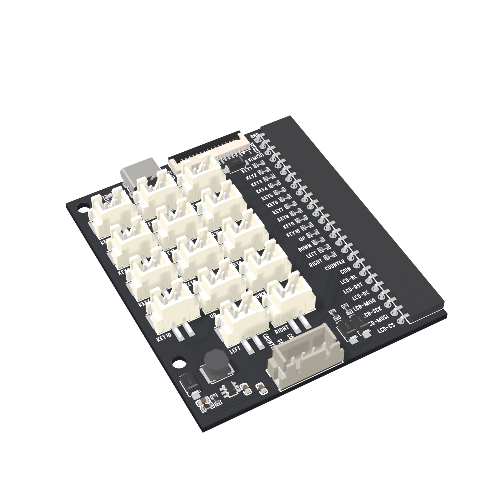

# 7. Build your own machine

[Previous](06-display.md) · [Home](../../README.md) · [Hardware downloads](../../hardware/README.md)

## Move from bench to enclosure

1. Complete the input, coin and display tests on the bench.
2. Import the mainboard and chosen adapter **STEP files** into your CAD project. Use the GLB files for visual layout.
3. Measure your actual buttons, joystick plate, coin acceptor and screen. Their cabinet cutouts are not defined by the PCB models.
4. Allow space for the development board, connector plugs, cable bends, coin path and coin collection box.
5. Add standoffs so the underside of each PCB cannot touch screws or the enclosure. Keep USB, reset buttons and the FPC latch accessible.
6. Print or cut a small mounting test before making the full enclosure.
7. Mount the parts, label the leads and repeat every functional test before closing the case.

The supplied models represent the boards. They are **not printable cabinet files**. Confirm scale and hole spacing against the actual parts before fabrication.

## Where to go next

| Project | Build on | Add |
| --- | --- | --- |
| Reaction game | Credit-game state machine | Random delay and false-start detection |
| Quiz buzzer | Input monitor | First-press lockout and a reset button |
| Museum exhibit | Credit counter | A timed interaction and a clear reset state |
| Retro cabinet | Zero 2 W controls | Input-to-keyboard/gamepad software and an emulator |
| PC arcade controller | ESP32-S3 inputs | USB HID firmware and host-side button mapping |

These examples read inputs; they do not automatically register as a USB/Bluetooth gamepad. A retro emulator needs a compatible input layer, and the SPI test display is not automatically a Linux desktop display. Console compatibility depends on the controller protocol and is not established by this kit's wiring.

For a cabinet, use games you own or have permission to run, provide strain relief for the cables, and keep the coin path clear of electronics.
