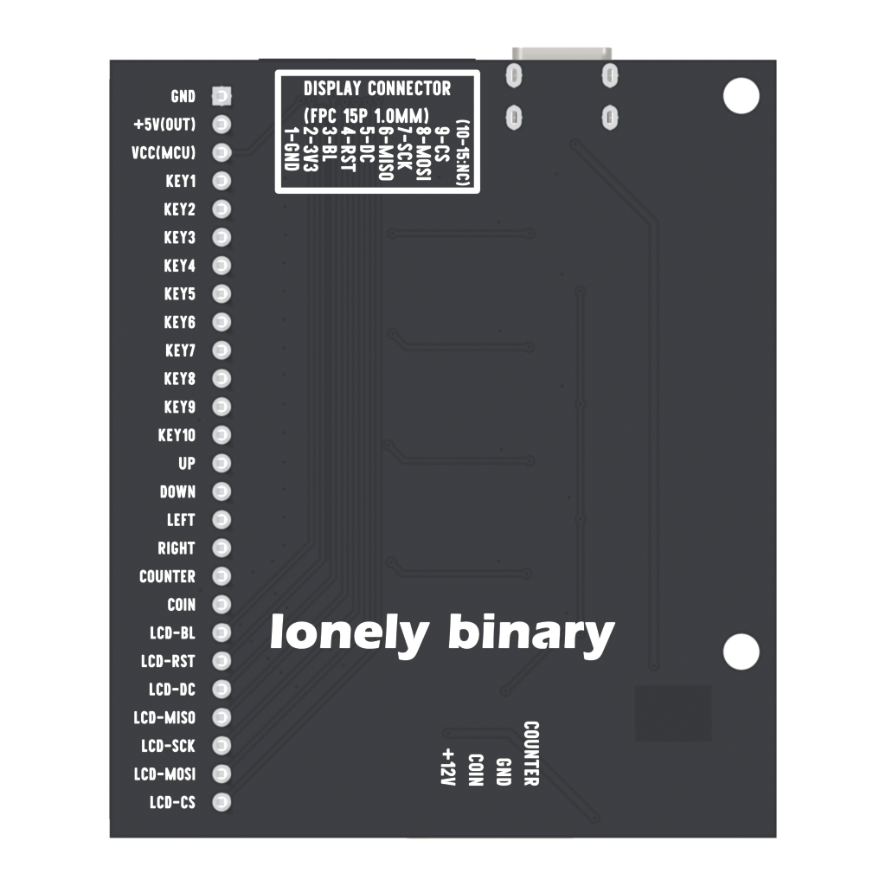

# Pin reference

[Home](../../README.md) · [Compatibility](compatibility.md) · [Schematics](../../hardware/README.md)

GPIO numbers below are **chip GPIO numbers**, not physical pin positions. Nano uses Arduino D/A labels; Zero 2 W uses BCM numbering. Match the board revision before using these tables.

## Buttons and joystick

Pressed = HIGH. Each input has a mainboard 10k pull-down. KEY11–KEY14 in the schematics correspond to UP, DOWN, LEFT, RIGHT on the board.

| Mainboard | Nano | ESP32-S3 GPIO | Pico GP | Zero 2 W BCM |
| --- | --- | --- | --- | --- |
| KEY1 | D2 | 4 | 16 | 4 |
| KEY2 | D3 | 5 | 17 | 5 |
| KEY3 | D4 | 6 | 18 | 6 |
| KEY4 | D5 | 7 | 19 | 12 |
| KEY5 | D6 | 15 | 20 | 13 |
| KEY6 | D7 | 16 | 21 | 16 |
| KEY7 | D8 | 17 | 15 | 17 |
| KEY8 | D9 | 18 | 14 | 19 |
| KEY9 | D10 | 8 | 13 | 14 |
| KEY10 | D11 | 40 | 12 | 15 |
| UP | D12 | 39 | 22 | 20 |
| DOWN | A4 | 38 | 11 | 21 |
| LEFT | A3 | 9 | 10 | 22 |
| RIGHT | A2 | 47 | 26 | 23 |

## Coin channels

| Signal | Mainboard header | Nano | ESP32-S3 GPIO | Pico GP | Zero 2 W BCM |
| --- | --- | --- | --- | --- | --- |
| COIN, from PCB exports | 19 | A0 | 14 | 28 | 26 |
| COUNTER, from PCB exports | 18 | A1 | 21 | 27 | 24 |

Original ESP32-S3 and Zero 2 W tests use GPIO21 and BCM24 respectively. Run the [probe](04-coins.md) to identify your working input. Coin detection uses low-going pulses and pull-ups. Do not connect 12 V directly to a GPIO.

## Display signals

| Signal | FPC pin | ESP32-S3 GPIO | Pico GP | Zero 2 W BCM | Zero physical pin |
| --- | --- | --- | --- | --- | --- |
| BL | 3 | 41 | 9 | 18 | 12 |
| RESET | 4 | 42 | 8 | 27 | 13 |
| DC | 5 | 2 | 7 | 25 | 22 |
| MISO | 6 | 13 | 6 | 9 | 21 |
| SCK | 7 | 12 | 5 | 11 | 23 |
| MOSI | 8 | 11 | 4 | 10 | 19 |
| CS | 9 | 10 | 3 | 8 / CE0 | 24 |

The Nano adapter leaves display signals unconnected. Pico uses SoftSPI. Zero 2 W CE0 is owned by the SPI driver; do not also claim BCM8 as a gpiozero output.

## Mainboard 26-pin header

Numbers are **connector pin numbers in the exports**, not MCU GPIO numbers. Use the marked GND end to orient the header; do not count from the wrong side of a flipped board.

| Pin | Function | Pin | Function |
| --- | --- | --- | --- |
| 1 | GND | 14 | UP / KEY11 |
| 2 | 5V OUT to adapter | 15 | DOWN / KEY12 |
| 3 | V(MCU), logic rail | 16 | LEFT / KEY13 |
| 4 | KEY1 | 17 | RIGHT / KEY14 |
| 5 | KEY2 | 18 | COUNTER route |
| 6 | KEY3 | 19 | COIN route |
| 7 | KEY4 | 20 | LCD BL |
| 8 | KEY5 | 21 | LCD RESET |
| 9 | KEY6 | 22 | LCD DC |
| 10 | KEY7 | 23 | LCD MISO |
| 11 | KEY8 | 24 | LCD SCK |
| 12 | KEY9 | 25 | LCD MOSI |
| 13 | KEY10 | 26 | LCD CS |

## Display FPC

The 15-position connector U5 uses **1.0 mm pitch**. Additional package pads in the netlist are mechanical mounting pads, not extra signal positions.

| FPC pin | Mainboard signal |
| --- | --- |
| 1 | GND |
| 2 | V(MCU) / VCC |
| 3 | BL |
| 4 | RESET |
| 5 | DC |
| 6 | MISO |
| 7 | SCK |
| 8 | MOSI |
| 9 | CS |
| 10–15 | D2–D7 labels; not routed to the 26-pin MCU header in this mainboard export |

These positions are not a universal display standard. Check the display-side adapter and cable contact orientation before connecting.

## Coin connector

CN43 electrical positions: **1 COUNTER, 2 GND, 3 COIN, 4 +12V**. Use the connector's pin-1 mark and board labels to orient it; viewing the mating side reverses left/right. Button connectors connect V(MCU) and the corresponding input signal.
